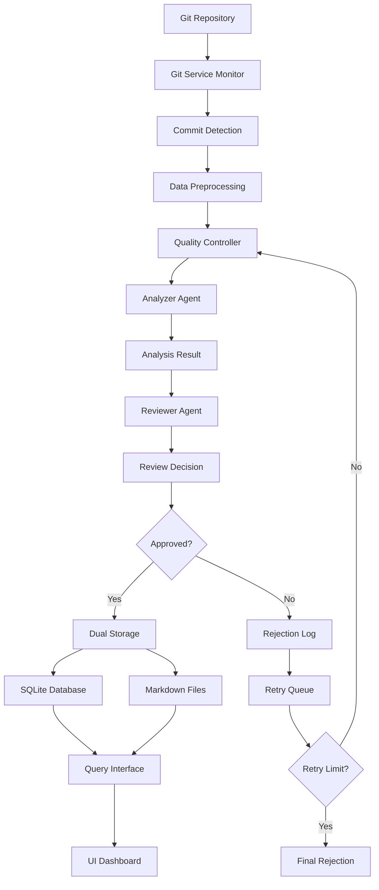
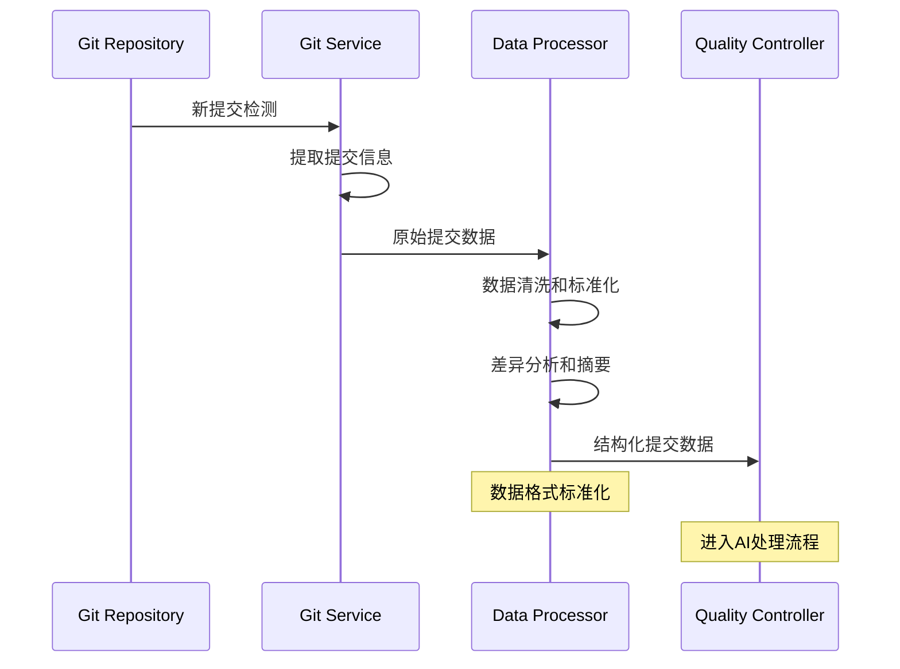
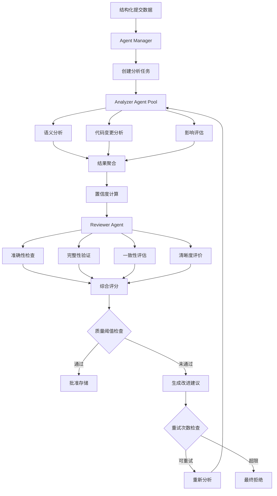
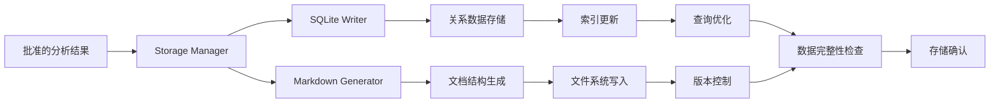
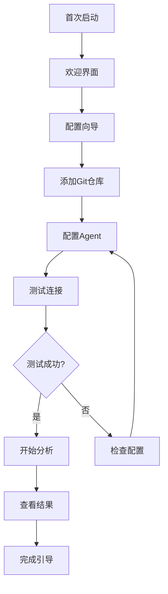
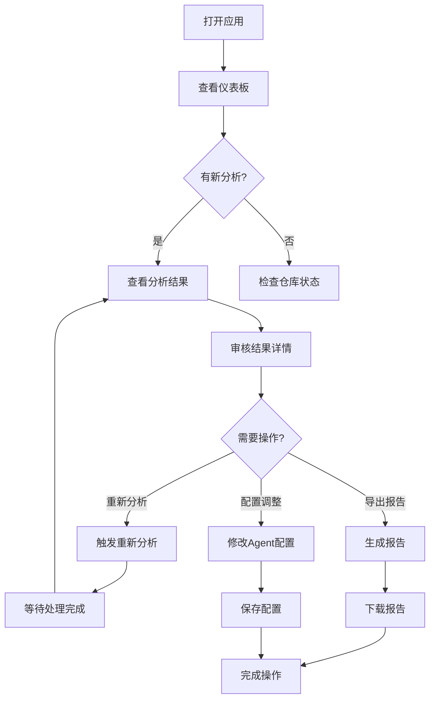

# GitMentor 数据流程和用户界面设计文档
## Data Flow and UI Design Document

### 文档信息
- **项目名称**: GitMentor AI Agent双重审核系统
- **版本**: v2.0
- **创建日期**: 2025年1月
- **最后更新**: 2025年1月
- **文档状态**: 详细设计
- **负责人**: UI/UX设计团队

---

## 1. 数据流程设计

### 1.1 核心数据流程图


### 1.2 数据处理管道

#### 1.2.1 输入数据流


#### 1.2.2 AI处理流程


#### 1.2.3 存储数据流


### 1.3 数据模型定义

#### 1.3.1 核心数据结构
```typescript
// 提交数据模型
interface CommitData {
  hash: string;
  message: string;
  author: {
    name: string;
    email: string;
  };
  timestamp: Date;
  branch: string;
  files: FileChange[];
  diff: string;
  repository: {
    name: string;
    path: string;
  };
}

// 文件变更模型
interface FileChange {
  path: string;
  type: 'added' | 'modified' | 'deleted' | 'renamed';
  insertions: number;
  deletions: number;
  binary: boolean;
}

// 分析结果模型
interface AnalysisResult {
  taskId: string;
  summary: string;
  category: CommitCategory;
  impactLevel: 'low' | 'medium' | 'high';
  filesAffected: string[];
  description: string;
  confidenceScore: number;
  processingTime: number;
  agentVersion: string;
}

// 审核结果模型
interface ReviewResult {
  taskId: string;
  approved: boolean;
  overallScore: number;
  dimensionScores: {
    accuracy: number;
    completeness: number;
    consistency: number;
    clarity: number;
  };
  feedback: string;
  suggestions: string[];
  revisionRequired: boolean;
  processingTime: number;
}
```

#### 1.3.2 配置数据模型
```typescript
// Agent配置模型
interface AgentConfig {
  agentType: 'analyzer' | 'reviewer';
  version: string;
  name: string;
  description: string;
  promptTemplate: string;
  parameters: {
    maxTokens: number;
    temperature: number;
    model: string;
    timeout: number;
  };
  qualityThresholds: {
    minimumScore: number;
    dimensionWeights: Record<string, number>;
  };
}

// 仓库配置模型
interface RepositoryConfig {
  name: string;
  path: string;
  type: string;
  agents: {
    analyzer: string;
    reviewer: string;
  };
  userMapping: Record<string, UserInfo>;
  analysisSettings: {
    autoAnalysis: boolean;
    batchSize: number;
    retryLimit: number;
  };
}
```

---

## 2. 用户界面设计

### 2.1 整体界面架构

#### 2.1.1 主界面布局
```
┌─────────────────────────────────────────────────────────────┐
│  GitMentor - AI Agent双重审核系统                           │
├─────────────────────────────────────────────────────────────┤
│ [仪表板] [分析结果] [Agent管理] [仓库配置] [系统设置]        │
├─────────────────────────────────────────────────────────────┤
│                                                             │
│  ┌─────────────────┐  ┌─────────────────────────────────┐   │
│  │   快速统计      │  │        实时处理状态             │   │
│  │                 │  │                                 │   │
│  │ 今日分析: 45    │  │  ┌─────┐ ┌─────┐ ┌─────┐       │   │
│  │ 通过率: 92%     │  │  │ 队列│ │处理中│ │完成 │       │   │
│  │ 平均质量: 0.89  │  │  │  3  │ │  2  │ │ 40  │       │   │
│  └─────────────────┘  │  └─────┘ └─────┘ └─────┘       │   │
│                       └─────────────────────────────────┘   │
│                                                             │
│  ┌─────────────────────────────────────────────────────┐   │
│  │                最近分析结果                         │   │
│  │                                                     │   │
│  │  [提交哈希] [作者] [时间] [状态] [质量分数] [操作]   │   │
│  │  abc123...  张三   14:30  ✅通过    0.92    [查看]  │   │
│  │  def456...  李四   14:25  ❌拒绝    0.76    [重试]  │   │
│  │  ghi789...  王五   14:20  🔄处理中   -      [取消]  │   │
│  └─────────────────────────────────────────────────────┘   │
└─────────────────────────────────────────────────────────────┘
```

#### 2.1.2 导航结构
```
GitMentor 主菜单
├── 仪表板 (Dashboard)
│   ├── 概览统计
│   ├── 实时状态
│   └── 快速操作
├── 分析结果 (Analysis Results)
│   ├── 提交分析列表
│   ├── 质量趋势图
│   ├── 贡献者统计
│   └── 详细报告
├── Agent管理 (Agent Management)
│   ├── Agent状态监控
│   ├── 配置管理
│   ├── 性能指标
│   └── 日志查看
├── 仓库配置 (Repository Config)
│   ├── 仓库列表
│   ├── 用户映射
│   ├── 分析设置
│   └── 同步状态
└── 系统设置 (System Settings)
    ├── 全局配置
    ├── API设置
    ├── 存储管理
    └── 安全设置
```

### 2.2 核心界面设计

#### 2.2.1 仪表板界面
```vue
<template>
  <div class="dashboard-container">
    <!-- 顶部统计卡片 -->
    <div class="stats-grid">
      <StatCard 
        title="今日分析"
        :value="todayAnalysis"
        icon="analysis"
        trend="+12%"
      />
      <StatCard 
        title="通过率"
        :value="approvalRate"
        icon="check"
        :color="approvalRate > 90 ? 'green' : 'orange'"
      />
      <StatCard 
        title="平均质量分"
        :value="averageQuality"
        icon="star"
        format="decimal"
      />
      <StatCard 
        title="活跃Agent"
        :value="activeAgents"
        icon="robot"
      />
    </div>

    <!-- 实时处理状态 -->
    <div class="processing-status">
      <h3>实时处理状态</h3>
      <div class="status-pipeline">
        <StatusNode 
          label="队列中"
          :count="queueCount"
          color="blue"
        />
        <StatusNode 
          label="分析中"
          :count="analyzingCount"
          color="orange"
          :animated="true"
        />
        <StatusNode 
          label="审核中"
          :count="reviewingCount"
          color="purple"
          :animated="true"
        />
        <StatusNode 
          label="已完成"
          :count="completedCount"
          color="green"
        />
      </div>
    </div>

    <!-- 质量趋势图表 -->
    <div class="quality-trends">
      <h3>质量趋势</h3>
      <QualityTrendChart 
        :data="qualityTrendData"
        :timeRange="selectedTimeRange"
        @timeRangeChange="handleTimeRangeChange"
      />
    </div>

    <!-- 最近分析结果 -->
    <div class="recent-results">
      <h3>最近分析结果</h3>
      <AnalysisResultTable 
        :data="recentResults"
        :columns="resultTableColumns"
        @rowClick="handleResultClick"
        @action="handleResultAction"
      />
    </div>
  </div>
</template>
```

#### 2.2.2 Agent管理界面
```vue
<template>
  <div class="agent-management">
    <!-- Agent状态概览 -->
    <div class="agent-overview">
      <div class="agent-grid">
        <AgentCard 
          v-for="agent in agents"
          :key="agent.id"
          :agent="agent"
          @configure="openAgentConfig"
          @restart="restartAgent"
          @viewLogs="viewAgentLogs"
        />
      </div>
    </div>

    <!-- Agent配置编辑器 -->
    <div class="config-editor" v-if="selectedAgent">
      <h3>{{ selectedAgent.name }} 配置</h3>
      <AgentConfigEditor 
        :agent="selectedAgent"
        :config="selectedAgent.config"
        @save="saveAgentConfig"
        @test="testAgentConfig"
        @cancel="closeConfigEditor"
      />
    </div>

    <!-- 性能监控 -->
    <div class="performance-monitoring">
      <h3>性能监控</h3>
      <div class="metrics-grid">
        <MetricChart 
          title="处理时间"
          :data="processingTimeData"
          type="line"
        />
        <MetricChart 
          title="成功率"
          :data="successRateData"
          type="area"
        />
        <MetricChart 
          title="资源使用"
          :data="resourceUsageData"
          type="bar"
        />
      </div>
    </div>

    <!-- 日志查看器 -->
    <div class="log-viewer" v-if="showLogs">
      <LogViewer 
        :agentId="selectedAgent?.id"
        :logLevel="selectedLogLevel"
        @close="closeLogs"
      />
    </div>
  </div>
</template>
```

#### 2.2.3 分析结果详情界面
```vue
<template>
  <div class="analysis-detail">
    <!-- 基本信息 -->
    <div class="commit-info">
      <h2>提交分析详情</h2>
      <div class="info-grid">
        <InfoItem label="提交哈希" :value="commit.hash" copyable />
        <InfoItem label="作者" :value="commit.author.name" />
        <InfoItem label="时间" :value="formatDate(commit.timestamp)" />
        <InfoItem label="分支" :value="commit.branch" />
      </div>
    </div>

    <!-- 双重审核流程 -->
    <div class="review-process">
      <h3>审核流程</h3>
      <div class="process-timeline">
        <TimelineStep 
          title="Analyzer Agent 分析"
          :status="analysisResult.status"
          :timestamp="analysisResult.timestamp"
          :duration="analysisResult.processingTime"
        >
          <AnalysisResultCard :result="analysisResult" />
        </TimelineStep>
        
        <TimelineStep 
          title="Reviewer Agent 审核"
          :status="reviewResult.status"
          :timestamp="reviewResult.timestamp"
          :duration="reviewResult.processingTime"
        >
          <ReviewResultCard :result="reviewResult" />
        </TimelineStep>
        
        <TimelineStep 
          title="最终决策"
          :status="finalDecision.status"
          :timestamp="finalDecision.timestamp"
        >
          <FinalDecisionCard :decision="finalDecision" />
        </TimelineStep>
      </div>
    </div>

    <!-- 质量评分详情 -->
    <div class="quality-scores">
      <h3>质量评分详情</h3>
      <div class="score-grid">
        <ScoreCard 
          title="准确性"
          :score="reviewResult.dimensionScores.accuracy"
          description="分析结果与实际提交内容的匹配度"
        />
        <ScoreCard 
          title="完整性"
          :score="reviewResult.dimensionScores.completeness"
          description="是否包含所有重要信息"
        />
        <ScoreCard 
          title="一致性"
          :score="reviewResult.dimensionScores.consistency"
          description="分类和描述的逻辑一致性"
        />
        <ScoreCard 
          title="清晰度"
          :score="reviewResult.dimensionScores.clarity"
          description="描述的清晰度和可理解性"
        />
      </div>
    </div>

    <!-- 改进建议 -->
    <div class="suggestions" v-if="reviewResult.suggestions.length > 0">
      <h3>改进建议</h3>
      <SuggestionList :suggestions="reviewResult.suggestions" />
    </div>

    <!-- 操作按钮 -->
    <div class="actions">
      <el-button @click="reanalyze" :loading="reanalyzing">
        重新分析
      </el-button>
      <el-button @click="exportReport" type="primary">
        导出报告
      </el-button>
      <el-button @click="viewMarkdown">
        查看Markdown
      </el-button>
    </div>
  </div>
</template>
```

### 2.3 响应式设计

#### 2.3.1 断点设计
```scss
// 响应式断点
$breakpoints: (
  'mobile': 768px,
  'tablet': 1024px,
  'desktop': 1200px,
  'wide': 1600px
);

// 移动端适配
@media (max-width: 768px) {
  .dashboard-container {
    .stats-grid {
      grid-template-columns: 1fr 1fr;
      gap: 1rem;
    }
    
    .processing-status {
      .status-pipeline {
        flex-direction: column;
        gap: 0.5rem;
      }
    }
    
    .recent-results {
      .result-table {
        font-size: 0.875rem;
        
        .action-column {
          display: none;
        }
      }
    }
  }
}

// 平板适配
@media (min-width: 769px) and (max-width: 1024px) {
  .agent-management {
    .agent-grid {
      grid-template-columns: repeat(2, 1fr);
    }
    
    .metrics-grid {
      grid-template-columns: 1fr;
    }
  }
}
```

#### 2.3.2 主题设计
```scss
// 主题变量
:root {
  // 主色调
  --primary-color: #3b82f6;
  --primary-light: #60a5fa;
  --primary-dark: #1d4ed8;
  
  // 状态色
  --success-color: #10b981;
  --warning-color: #f59e0b;
  --error-color: #ef4444;
  --info-color: #06b6d4;
  
  // 中性色
  --gray-50: #f9fafb;
  --gray-100: #f3f4f6;
  --gray-200: #e5e7eb;
  --gray-300: #d1d5db;
  --gray-400: #9ca3af;
  --gray-500: #6b7280;
  --gray-600: #4b5563;
  --gray-700: #374151;
  --gray-800: #1f2937;
  --gray-900: #111827;
  
  // 背景色
  --bg-primary: #ffffff;
  --bg-secondary: var(--gray-50);
  --bg-tertiary: var(--gray-100);
  
  // 文字色
  --text-primary: var(--gray-900);
  --text-secondary: var(--gray-600);
  --text-tertiary: var(--gray-400);
  
  // 边框色
  --border-color: var(--gray-200);
  --border-hover: var(--gray-300);
  
  // 阴影
  --shadow-sm: 0 1px 2px 0 rgba(0, 0, 0, 0.05);
  --shadow-md: 0 4px 6px -1px rgba(0, 0, 0, 0.1);
  --shadow-lg: 0 10px 15px -3px rgba(0, 0, 0, 0.1);
}

// 暗色主题
[data-theme="dark"] {
  --bg-primary: var(--gray-900);
  --bg-secondary: var(--gray-800);
  --bg-tertiary: var(--gray-700);
  
  --text-primary: var(--gray-100);
  --text-secondary: var(--gray-300);
  --text-tertiary: var(--gray-500);
  
  --border-color: var(--gray-700);
  --border-hover: var(--gray-600);
}
```

---

## 3. 交互设计

### 3.1 用户操作流程

#### 3.1.1 新用户引导流程


#### 3.1.2 日常使用流程


### 3.2 状态反馈设计

#### 3.2.1 处理状态指示器
```vue
<template>
  <div class="status-indicator" :class="statusClass">
    <div class="status-icon">
      <LoadingSpinner v-if="status === 'processing'" />
      <CheckIcon v-else-if="status === 'success'" />
      <ErrorIcon v-else-if="status === 'error'" />
      <ClockIcon v-else-if="status === 'pending'" />
    </div>
    <div class="status-text">
      <span class="status-label">{{ statusLabel }}</span>
      <span class="status-detail" v-if="statusDetail">{{ statusDetail }}</span>
    </div>
    <div class="status-progress" v-if="showProgress">
      <ProgressBar :value="progress" />
    </div>
  </div>
</template>
```

#### 3.2.2 通知系统
```typescript
// 通知类型定义
interface Notification {
  id: string;
  type: 'success' | 'warning' | 'error' | 'info';
  title: string;
  message: string;
  duration?: number;
  actions?: NotificationAction[];
}

// 通知管理器
class NotificationManager {
  private notifications: Notification[] = [];
  
  success(title: string, message: string, duration = 3000) {
    this.add({
      type: 'success',
      title,
      message,
      duration
    });
  }
  
  error(title: string, message: string, actions?: NotificationAction[]) {
    this.add({
      type: 'error',
      title,
      message,
      duration: 0, // 错误通知不自动消失
      actions
    });
  }
  
  agentProcessingComplete(agentType: string, result: any) {
    this.success(
      `${agentType} 处理完成`,
      `分析任务已完成，质量分数: ${result.qualityScore}`
    );
  }
  
  qualityCheckFailed(reason: string, suggestions: string[]) {
    this.error(
      '质量检查未通过',
      reason,
      [
        { label: '查看详情', action: 'view-details' },
        { label: '重新分析', action: 'retry-analysis' }
      ]
    );
  }
}
```

---

*本文档将根据用户反馈和设计迭代持续更新和完善。*
