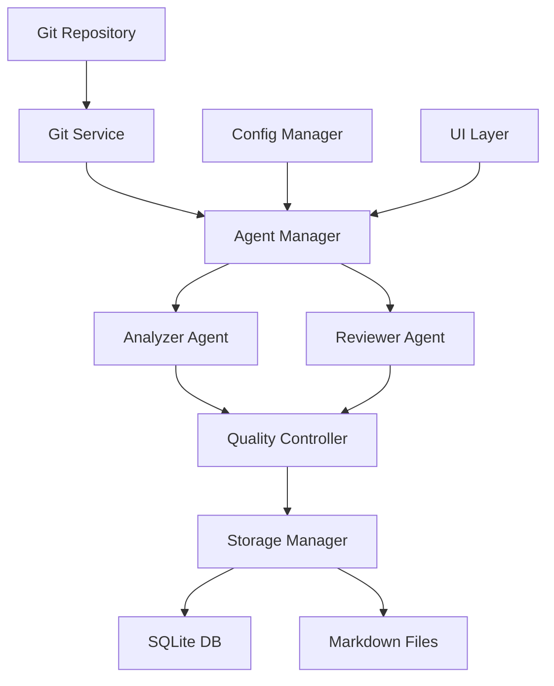

# GitMentor 产品需求文档 (PRD)
## Product Requirements Document

### 文档信息
- **项目名称**: GitMentor AI Agent双重审核系统
- **版本**: v2.0
- **创建日期**: 2025年1月
- **最后更新**: 2025年1月
- **文档状态**: 详细设计
- **负责人**: 产品开发团队

---

## 1. 产品概述

### 1.1 产品愿景
构建业界领先的AI驱动Git提交分析平台，通过双重AI Agent审核机制，为开发团队提供高质量、可靠的代码贡献分析和工作内容总结。

### 1.2 产品定位
- **目标用户**: 软件开发团队、项目经理、代码审查员
- **核心价值**: 智能化、高质量、可扩展的Git分析解决方案
- **差异化优势**: AI双重审核机制确保分析结果的准确性和一致性

### 1.3 产品目标
- 实现AI Agent双重审核系统
- 支持多仓库统一管理
- 提供灵活的Agent配置机制
- 建立可扩展的存储架构

---

## 2. 功能需求规格

### 2.1 AI Agent双重审核系统

#### 2.1.1 Agent A (分析Agent)
**功能描述**: 负责分析Git提交记录并生成提交内容总结

**详细规格**:
- **输入**: Git提交记录 (hash, message, diff, author, timestamp)
- **处理**: 
  - 解析提交消息语义
  - 分析代码变更内容
  - 识别变更类型 (feature, bugfix, refactor, docs等)
  - 评估变更影响范围
- **输出**: 结构化的提交总结
  ```json
  {
    "commit_hash": "abc123...",
    "summary": "添加用户认证功能",
    "category": "feature",
    "impact_level": "medium",
    "files_affected": ["auth.py", "models.py"],
    "description": "实现了基于JWT的用户认证系统...",
    "confidence_score": 0.85
  }
  ```

**质量标准**:
- 总结准确性 > 90%
- 分类准确性 > 95%
- 响应时间 < 5秒
- 置信度分数 > 0.8

#### 2.1.2 Agent B (审核Agent)
**功能描述**: 负责审核Agent A的总结内容，判断是否通过质量标准

**详细规格**:
- **输入**: Agent A的分析结果 + 原始提交数据
- **审核维度**:
  - **准确性**: 总结是否准确反映提交内容
  - **完整性**: 是否遗漏重要信息
  - **一致性**: 分类和描述是否一致
  - **清晰度**: 描述是否清晰易懂
- **输出**: 审核结果
  ```json
  {
    "approved": true,
    "quality_score": 0.92,
    "feedback": {
      "accuracy": 0.95,
      "completeness": 0.90,
      "consistency": 0.93,
      "clarity": 0.90
    },
    "suggestions": ["建议补充性能影响说明"],
    "revision_required": false
  }
  ```

**审核标准**:
- 综合质量分数 > 0.85 才能通过
- 各维度分数均 > 0.80
- 关键信息不能遗漏

#### 2.1.3 审核流程控制
**流程规格**:
1. Agent A生成初始分析
2. Agent B进行质量审核
3. 如果通过审核 → 保存到系统
4. 如果未通过 → 记录反馈，可选择重新分析
5. 提供人工干预接口

**配置参数**:
- 最大重试次数: 3次
- 审核超时时间: 30秒
- 质量阈值: 可配置 (默认0.85)

### 2.2 Agent配置管理系统

#### 2.2.1 Prompt模板管理
**功能描述**: 为每个Agent创建独立的prompt模板文件

**文件结构**:
```
/config/agents/
├── analyzer/
│   ├── base_prompt.txt
│   ├── code_analysis_prompt.txt
│   └── summary_generation_prompt.txt
├── reviewer/
│   ├── base_prompt.txt
│   ├── quality_check_prompt.txt
│   └── feedback_generation_prompt.txt
└── templates/
    ├── commit_template.json
    └── review_template.json
```

**模板格式**:
```yaml
# analyzer/base_prompt.txt
name: "Git Commit Analyzer"
version: "1.0"
description: "分析Git提交记录并生成结构化总结"
prompt: |
  你是一个专业的Git提交分析专家。请分析以下提交记录：
  
  提交信息: {commit_message}
  文件变更: {file_changes}
  代码差异: {code_diff}
  
  请生成结构化的分析结果，包括：
  1. 简洁的总结
  2. 变更类型分类
  3. 影响范围评估
  4. 置信度评分
  
parameters:
  max_tokens: 1000
  temperature: 0.3
  model: "gpt-4"
```

#### 2.2.2 动态配置更新
**功能规格**:
- 支持热更新prompt模板
- 版本控制和回滚机制
- 配置验证和测试接口
- 配置变更日志记录

**API接口**:
```python
# 更新Agent配置
PUT /api/agents/{agent_id}/config
{
  "prompt_template": "...",
  "parameters": {...},
  "version": "1.1"
}

# 测试配置
POST /api/agents/{agent_id}/test
{
  "test_data": {...},
  "config_version": "1.1"
}
```

#### 2.2.3 扩展接口设计
**接口规格**:
```python
class AgentInterface:
    def process(self, input_data: Dict) -> Dict:
        """处理输入数据并返回结果"""
        pass
    
    def validate_config(self, config: Dict) -> bool:
        """验证配置有效性"""
        pass
    
    def get_capabilities(self) -> List[str]:
        """返回Agent能力列表"""
        pass
```

**扩展示例**:
- Code Quality Agent: 代码质量评估
- Security Analysis Agent: 安全漏洞检测
- Performance Impact Agent: 性能影响分析

### 2.3 双重存储机制

#### 2.3.1 SQLite数据库存储
**数据库设计**:
```sql
-- Agent分析结果表
CREATE TABLE agent_analyses (
    id INTEGER PRIMARY KEY AUTOINCREMENT,
    commit_id INTEGER NOT NULL,
    agent_type TEXT NOT NULL, -- 'analyzer' or 'reviewer'
    agent_version TEXT NOT NULL,
    input_data TEXT NOT NULL,
    output_data TEXT NOT NULL,
    quality_score REAL,
    processing_time INTEGER,
    created_at TIMESTAMP DEFAULT CURRENT_TIMESTAMP,
    FOREIGN KEY (commit_id) REFERENCES commits (id)
);

-- Agent配置表
CREATE TABLE agent_configs (
    id INTEGER PRIMARY KEY AUTOINCREMENT,
    agent_type TEXT NOT NULL,
    config_name TEXT NOT NULL,
    config_data TEXT NOT NULL,
    version TEXT NOT NULL,
    is_active BOOLEAN DEFAULT FALSE,
    created_at TIMESTAMP DEFAULT CURRENT_TIMESTAMP
);

-- 审核流程记录表
CREATE TABLE review_processes (
    id INTEGER PRIMARY KEY AUTOINCREMENT,
    commit_id INTEGER NOT NULL,
    analyzer_result_id INTEGER,
    reviewer_result_id INTEGER,
    final_status TEXT NOT NULL, -- 'approved', 'rejected', 'pending'
    retry_count INTEGER DEFAULT 0,
    completed_at TIMESTAMP,
    FOREIGN KEY (commit_id) REFERENCES commits (id)
);
```

#### 2.3.2 Markdown文件存储
**目录结构**:
```
/workspace/
├── {仓库名称}/
│   ├── {提交人}/
│   │   ├── {年份}/
│   │   │   ├── {月份}/
│   │   │   │   ├── daily_summary_YYYY-MM-DD.md
│   │   │   │   └── commits/
│   │   │   │       ├── commit_abc123.md
│   │   │   │       └── commit_def456.md
│   │   │   └── monthly_summary_YYYY-MM.md
│   │   └── contributor_profile.md
│   ├── repository_overview.md
│   └── analytics/
│       ├── quality_trends.md
│       └── team_insights.md
```

**文件格式示例**:
```markdown
# 提交分析报告
## commit_abc123.md

### 基本信息
- **提交哈希**: abc123def456
- **作者**: 张三 <zhangsan@example.com>
- **时间**: 2025-01-15 14:30:00
- **分支**: feature/user-auth

### Agent A 分析结果
- **总结**: 添加用户认证功能
- **类型**: feature
- **影响级别**: medium
- **置信度**: 0.85

### Agent B 审核结果
- **审核状态**: ✅ 通过
- **质量评分**: 0.92
- **审核意见**: 分析准确，建议补充安全考虑

### 详细分析
...
```

### 2.4 多仓库配置支持

#### 2.4.1 仓库配置管理
**配置文件格式**:
```yaml
# repositories.yaml
repositories:
  - name: "frontend-app"
    path: "/path/to/frontend"
    type: "javascript"
    agents:
      analyzer: "js-analyzer-v1"
      reviewer: "code-quality-reviewer-v1"
    user_mapping:
      "john@company.com": "John Smith"
      "jane@company.com": "Jane Doe"
    
  - name: "backend-api"
    path: "/path/to/backend"
    type: "python"
    agents:
      analyzer: "python-analyzer-v1"
      reviewer: "security-reviewer-v1"
    user_mapping:
      "dev1@company.com": "Developer One"
```

#### 2.4.2 用户账号映射
**功能规格**:
- 支持邮箱到真实姓名的映射
- 支持多个邮箱对应同一用户
- 支持用户别名和团队分组
- 提供用户信息同步接口

**数据结构**:
```json
{
  "user_mappings": {
    "john@company.com": {
      "display_name": "John Smith",
      "aliases": ["j.smith@company.com"],
      "team": "Frontend Team",
      "role": "Senior Developer"
    }
  }
}
```

#### 2.4.3 差异化Agent配置
**配置策略**:
- 不同仓库可使用不同的Agent版本
- 支持语言特定的分析规则
- 可配置不同的质量标准
- 支持团队特定的审核流程

---

## 3. 非功能需求

### 3.1 性能要求
- **响应时间**: Agent分析 < 5秒，审核 < 3秒
- **并发处理**: 支持10个并发分析任务
- **内存使用**: 峰值 < 2GB
- **存储效率**: 压缩率 > 70%

### 3.2 可靠性要求
- **系统可用性**: 99.5%
- **数据一致性**: 强一致性保证
- **错误恢复**: 自动重试和降级机制
- **备份策略**: 每日自动备份

### 3.3 安全要求
- **数据加密**: 敏感数据AES-256加密
- **访问控制**: 基于角色的权限管理
- **审计日志**: 完整的操作记录
- **API安全**: Token认证和限流

### 3.4 可扩展性要求
- **水平扩展**: 支持多实例部署
- **插件架构**: 支持第三方Agent扩展
- **配置热更新**: 无需重启的配置更新
- **版本兼容**: 向后兼容保证

---

## 4. 用户界面设计

### 4.1 Agent管理界面
**功能模块**:
- Agent配置编辑器
- 实时性能监控
- 审核流程可视化
- 质量趋势图表

### 4.2 分析结果展示
**展示内容**:
- 双重审核状态
- 质量评分可视化
- 分析结果对比
- 历史趋势分析

### 4.3 配置管理界面
**管理功能**:
- 仓库配置向导
- 用户映射管理
- Agent版本控制
- 系统健康检查

---

## 5. 技术架构

### 5.1 系统架构图


### 5.2 核心组件
- **Agent Manager**: Agent生命周期管理
- **Quality Controller**: 审核流程控制
- **Storage Manager**: 双重存储协调
- **Config Manager**: 配置管理和热更新

### 5.3 技术选型
- **后端框架**: FastAPI (Python)
- **前端框架**: Vue 3 + TypeScript
- **数据库**: SQLite + 文件系统
- **AI集成**: OpenAI API / Anthropic API
- **配置管理**: YAML + JSON

---

## 6. 数据流程

### 6.1 分析流程
```
Git Commit → Agent A → Quality Check → Agent B → Storage Decision → Dual Storage
```

### 6.2 配置流程
```
Config Update → Validation → Version Control → Hot Reload → Agent Restart
```

### 6.3 查询流程
```
User Request → Cache Check → DB Query → File System → Result Aggregation → Response
```

---

## 7. 测试策略

### 7.1 单元测试
- Agent功能测试
- 配置管理测试
- 存储机制测试
- API接口测试

### 7.2 集成测试
- Agent协作测试
- 端到端流程测试
- 性能压力测试
- 数据一致性测试

### 7.3 用户验收测试
- 功能完整性验证
- 用户体验测试
- 性能基准验证
- 安全性测试

---

## 8. 发布计划

### 8.1 版本规划
- **v2.0-alpha**: 核心Agent系统
- **v2.0-beta**: 完整功能测试
- **v2.0-rc**: 发布候选版本
- **v2.0-stable**: 正式发布版本

### 8.2 发布标准
- 所有测试用例通过
- 性能指标达标
- 文档完整性检查
- 安全审计通过

---

## 9. 实施计划

### 9.1 开发阶段

#### 第一阶段：Agent架构设计 (4周)
**目标**: 建立AI Agent双重审核系统的基础架构

**主要任务**:
- 设计Agent接口和抽象类
- 实现Agent Manager核心功能
- 创建基础的Analyzer Agent
- 实现简单的Reviewer Agent
- 建立Agent间通信机制

**可交付成果**:
- Agent架构设计文档
- 基础Agent实现代码
- 单元测试用例
- API接口定义

**验收标准**:
- Agent可以独立运行
- 基础分析功能正常
- 接口设计通过评审

#### 第二阶段：双重审核机制 (3周)
**目标**: 实现完整的双重审核流程

**主要任务**:
- 完善Analyzer Agent的分析能力
- 实现Reviewer Agent的审核逻辑
- 建立质量控制机制
- 实现审核流程管理
- 添加重试和异常处理

**可交付成果**:
- 完整的双重审核系统
- 质量评分算法
- 流程控制逻辑
- 异常处理机制

**验收标准**:
- 审核准确率 > 90%
- 流程稳定性测试通过
- 异常情况正确处理

#### 第三阶段：存储系统和配置管理 (3周)
**目标**: 实现双重存储机制和Agent配置管理

**主要任务**:
- 实现SQLite数据库存储
- 建立Markdown文件存储系统
- 开发配置管理模块
- 实现多仓库支持
- 创建用户映射功能

**可交付成果**:
- 双重存储系统
- 配置管理界面
- 多仓库配置支持
- 数据迁移工具

**验收标准**:
- 数据一致性验证通过
- 配置热更新功能正常
- 多仓库场景测试通过

#### 第四阶段：测试和优化 (2周)
**目标**: 全面测试和性能优化

**主要任务**:
- 集成测试和端到端测试
- 性能优化和调优
- 安全性测试和加固
- 用户体验优化
- Bug修复和稳定性改进

**可交付成果**:
- 完整的测试报告
- 性能优化报告
- 安全审计报告
- 稳定版本代码

**验收标准**:
- 所有测试用例通过
- 性能指标达到要求
- 安全审计无高危问题

#### 第五阶段：文档和发布准备 (2周)
**目标**: 完善文档和准备产品发布

**主要任务**:
- 编写用户手册和API文档
- 创建部署和运维指南
- 制作演示和培训材料
- 准备发布包和安装程序
- 建立用户支持体系

**可交付成果**:
- 完整的产品文档
- 部署和运维指南
- 用户培训材料
- 发布安装包

**验收标准**:
- 文档完整性检查通过
- 安装部署流程验证
- 用户培训效果良好

### 9.2 资源分配

#### 人力资源
- **项目经理**: 1人，全程参与
- **架构师**: 1人，前3个阶段重点参与
- **后端开发**: 2人，全程参与
- **前端开发**: 1人，第3-5阶段参与
- **测试工程师**: 1人，第2-4阶段参与
- **技术文档**: 1人，第4-5阶段参与

#### 技术资源
- **开发环境**: 云服务器 + 本地开发机
- **AI API**: OpenAI GPT-4 + Anthropic Claude
- **测试环境**: 模拟多仓库测试数据
- **部署环境**: Docker容器化部署

### 9.3 风险管控

#### 技术风险
- **AI API稳定性**: 建立多供应商备份方案
- **性能瓶颈**: 提前进行压力测试和优化
- **数据一致性**: 实现强一致性保证机制
- **配置复杂性**: 提供配置向导和验证工具

#### 进度风险
- **需求变更**: 建立变更控制流程
- **技术难题**: 预留技术攻关时间
- **资源冲突**: 制定详细的资源计划
- **集成问题**: 提前进行集成测试

---

## 10. 质量保证

### 10.1 代码质量标准
- **代码覆盖率**: 单元测试覆盖率 > 85%
- **代码规范**: 严格遵循PEP8和ESLint规范
- **代码审查**: 所有代码必须经过同行评审
- **静态分析**: 使用SonarQube进行代码质量检查

### 10.2 功能质量标准
- **功能完整性**: 所有PRD功能100%实现
- **用户体验**: 界面响应时间 < 1秒
- **错误处理**: 优雅的错误提示和恢复机制
- **数据准确性**: 分析结果准确率 > 95%

### 10.3 性能质量标准
- **响应时间**: API响应时间 < 2秒
- **并发能力**: 支持50个并发用户
- **内存使用**: 稳定运行内存 < 1GB
- **存储效率**: 数据压缩率 > 60%

### 10.4 安全质量标准
- **数据加密**: 敏感数据全程加密
- **访问控制**: 基于角色的权限管理
- **审计日志**: 完整的操作审计记录
- **漏洞扫描**: 定期安全漏洞扫描

---

## 11. 运维和监控

### 11.1 系统监控
- **性能监控**: CPU、内存、磁盘使用率
- **业务监控**: Agent处理成功率、审核通过率
- **错误监控**: 异常日志和错误统计
- **用户行为**: 功能使用情况和用户活跃度

### 11.2 告警机制
- **系统告警**: 资源使用超阈值告警
- **业务告警**: 处理失败率超标告警
- **安全告警**: 异常访问和安全事件告警
- **性能告警**: 响应时间超标告警

### 11.3 运维工具
- **日志管理**: 集中化日志收集和分析
- **配置管理**: 版本化配置管理
- **部署工具**: 自动化部署和回滚
- **备份恢复**: 自动化数据备份和恢复

---

## 12. 用户培训和支持

### 12.1 用户培训计划
- **管理员培训**: 系统配置和管理培训
- **最终用户培训**: 功能使用和最佳实践
- **开发者培训**: API使用和扩展开发
- **在线培训**: 视频教程和文档资料

### 12.2 支持体系
- **技术支持**: 7x24小时技术支持热线
- **用户社区**: 在线用户交流社区
- **知识库**: 常见问题和解决方案库
- **版本更新**: 定期功能更新和Bug修复

---

## 13. 成功指标和评估

### 13.1 技术指标
- **系统稳定性**: 99.5%可用性
- **处理效率**: 平均处理时间 < 3秒
- **准确率**: 分析准确率 > 95%
- **用户满意度**: 用户评分 > 4.5/5

### 13.2 业务指标
- **用户采用率**: 目标用户采用率 > 80%
- **功能使用率**: 核心功能使用率 > 70%
- **用户留存率**: 月活跃用户留存率 > 85%
- **推荐度**: 净推荐值(NPS) > 50

### 13.3 评估方法
- **定期评估**: 每月进行指标评估
- **用户反馈**: 收集和分析用户反馈
- **数据分析**: 基于使用数据的深度分析
- **持续改进**: 根据评估结果持续优化

---

## 14. 附录

### 14.1 术语表
- **Agent**: 执行特定任务的AI智能体
- **双重审核**: 两个Agent协作的质量控制机制
- **Prompt模板**: AI Agent的指令模板
- **质量评分**: 对分析结果质量的量化评估

### 14.2 参考文档
- GitMentor开发计划文档
- 现有系统架构文档
- AI Agent最佳实践指南
- 代码质量标准文档

### 14.3 变更记录
| 版本 | 日期 | 变更内容 | 变更人 |
|------|------|----------|--------|
| 1.0 | 2025-01-XX | 初始版本创建 | 产品团队 |
| 1.1 | 2025-01-XX | 添加详细实施计划 | 产品团队 |

---

*本文档将根据开发进展和用户反馈持续更新和完善。*
