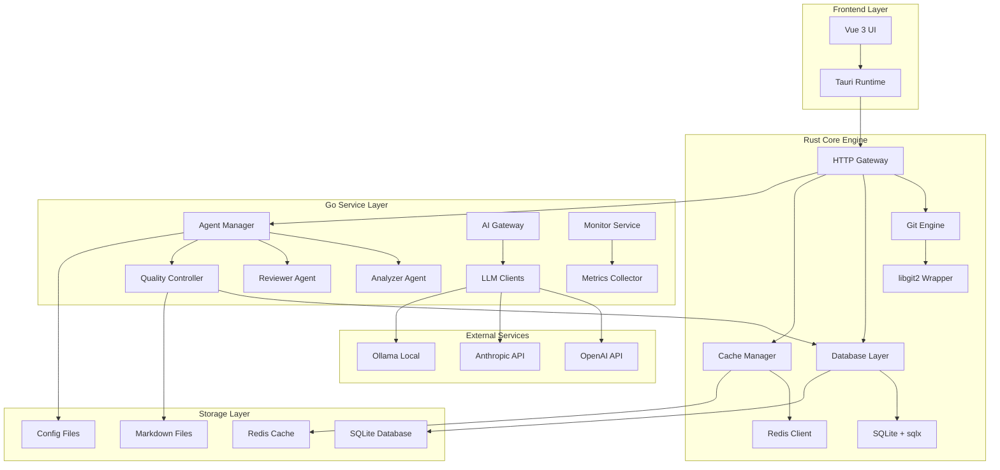
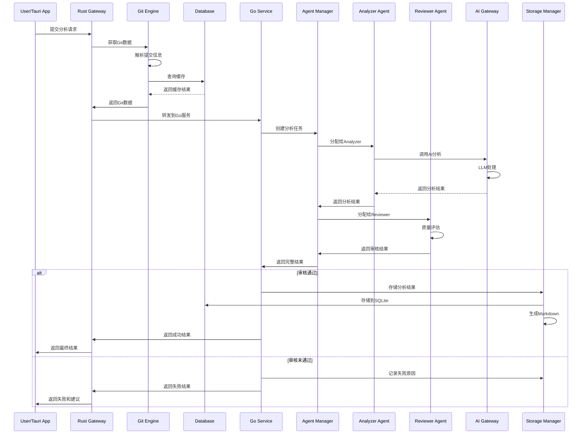
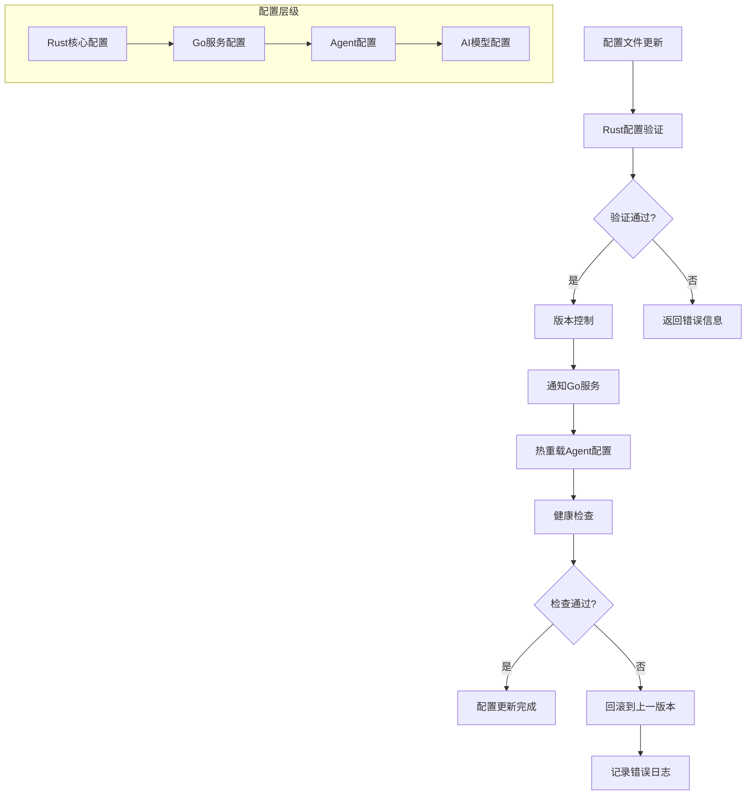

# GitMentor 技术架构设计文档
## Technical Architecture Design

### 文档信息
- **项目名称**: GitMentor AI Agent双重审核系统
- **版本**: v3.0 (Rust+Go混合架构)
- **创建日期**: 2025年1月
- **最后更新**: 2025年1月
- **文档状态**: 迁移后架构设计
- **负责人**: 技术架构团队

---

## 1. 架构概述

### 1.1 系统架构图


### 1.2 核心设计原则
- **高性能**: Rust核心引擎提供极致性能
- **并发安全**: Go协程池处理并发任务
- **模块化**: 每个组件职责单一，松耦合设计
- **可扩展性**: 支持新Agent类型的动态添加
- **可配置性**: 所有关键参数支持配置化管理
- **容错性**: 完善的错误处理和恢复机制
- **零依赖**: 静态编译，无运行时依赖

### 1.3 技术选型说明
- **前端**: Vue 3 + TypeScript + Tauri (跨平台桌面应用)
- **核心引擎**: Rust + tokio + libgit2 + sqlx (高性能异步处理)
- **服务层**: Go + Gin + gRPC + 协程池 (业务逻辑处理)
- **存储**: SQLite + Redis + 文件系统 (多层存储架构)
- **AI集成**: 统一AI网关支持多LLM提供商
- **部署**: Docker + 静态二进制 (容器化 + 原生部署)
- **监控**: Prometheus + Grafana (现代化监控栈)

---

## 2. 核心组件设计

### 2.1 Rust核心引擎

#### 2.1.1 组件职责
- 高性能Git操作 (基于libgit2)
- 数据库访问层 (SQLite + sqlx)
- 缓存管理 (Redis + 内存缓存)
- HTTP网关 (请求路由和认证)
- 系统监控 (性能指标收集)

#### 2.1.2 核心模块设计
```rust
// Git引擎模块
pub mod git_engine {
    use git2::{Repository, Commit, Diff};
    use tokio::sync::RwLock;

    pub struct GitEngine {
        repositories: RwLock<HashMap<String, Repository>>,
        config: GitConfig,
    }

    impl GitEngine {
        pub async fn analyze_commit(&self, repo_path: &str, commit_hash: &str) -> Result<CommitAnalysis> {
            // 高性能Git操作实现
        }

        pub async fn get_diff(&self, repo_path: &str, commit_hash: &str) -> Result<DiffData> {
            // 差异分析实现
        }

        pub async fn watch_repository(&self, repo_path: &str) -> Result<()> {
            // 仓库监控实现
        }
    }
}

// 数据库访问层
pub mod database {
    use sqlx::{SqlitePool, Row};
    use serde::{Serialize, Deserialize};

    pub struct DatabaseManager {
        pool: SqlitePool,
        cache: Arc<RwLock<LruCache<String, String>>>,
    }

    impl DatabaseManager {
        pub async fn store_analysis(&self, analysis: &AnalysisResult) -> Result<i64> {
            // 高性能数据存储
        }

        pub async fn query_analyses(&self, filter: &QueryFilter) -> Result<Vec<AnalysisResult>> {
            // 优化查询实现
        }
    }
}
```

#### 2.1.3 配置结构
```toml
# Cargo.toml
[package]
name = "gitmentor-core"
version = "3.0.0"
edition = "2021"

[dependencies]
tokio = { version = "1.0", features = ["full"] }
git2 = "0.18"
sqlx = { version = "0.7", features = ["sqlite", "runtime-tokio-rustls"] }
redis = { version = "0.24", features = ["tokio-comp"] }
serde = { version = "1.0", features = ["derive"] }
axum = "0.7"
tracing = "0.1"
```

```yaml
# config/rust-core.yaml
git_engine:
  max_repositories: 100
  diff_context_lines: 3
  cache_size: 1000

database:
  connection_pool_size: 10
  query_timeout: 30
  cache_ttl: 3600

http_gateway:
  bind_address: "0.0.0.0:8080"
  max_connections: 1000
  request_timeout: 60
```

### 2.2 Go服务层

#### 2.2.1 Agent管理器设计
```go
package agent

import (
    "context"
    "sync"
    "time"
)

type AgentManager struct {
    agents     map[string]Agent
    taskQueue  chan Task
    config     *Config
    metrics    *MetricsCollector
    mu         sync.RWMutex
}

type Agent interface {
    Process(ctx context.Context, input *AgentInput) (*AgentOutput, error)
    GetCapabilities() []string
    HealthCheck() error
    ReloadConfig(config map[string]interface{}) error
}

type AgentInput struct {
    TaskID   string                 `json:"task_id"`
    Data     map[string]interface{} `json:"data"`
    Context  map[string]interface{} `json:"context"`
    Metadata map[string]interface{} `json:"metadata"`
}

type AgentOutput struct {
    TaskID         string                 `json:"task_id"`
    Result         map[string]interface{} `json:"result"`
    Confidence     float64                `json:"confidence"`
    ProcessingTime time.Duration          `json:"processing_time"`
    Metadata       map[string]interface{} `json:"metadata"`
}

func (am *AgentManager) ProcessTask(ctx context.Context, task *Task) (*ProcessResult, error) {
    // 任务处理逻辑
    return nil, nil
}

func (am *AgentManager) RegisterAgent(agentType string, agent Agent) error {
    am.mu.Lock()
    defer am.mu.Unlock()
    am.agents[agentType] = agent
    return nil
}
```

### 2.3 Analyzer Agent (分析Agent)

#### 2.3.1 Go实现
```go
package analyzer

import (
    "context"
    "encoding/json"
    "fmt"
    "time"

    "github.com/gitmentor/internal/ai"
    "github.com/gitmentor/internal/git"
)

type GitCommitAnalyzer struct {
    agentID      string
    config       *AnalyzerConfig
    aiClient     ai.Client
    gitEngine    git.Engine
    promptLoader *PromptLoader
}

type AnalyzerConfig struct {
    MaxTokens     int     `yaml:"max_tokens"`
    Temperature   float64 `yaml:"temperature"`
    Model         string  `yaml:"model"`
    PromptVersion string  `yaml:"prompt_version"`
}

func NewGitCommitAnalyzer(agentID string, config *AnalyzerConfig) *GitCommitAnalyzer {
    return &GitCommitAnalyzer{
        agentID:      agentID,
        config:       config,
        aiClient:     ai.NewClient(config.Model),
        gitEngine:    git.NewEngine(),
        promptLoader: NewPromptLoader(config.PromptVersion),
    }
}

func (a *GitCommitAnalyzer) Process(ctx context.Context, input *AgentInput) (*AgentOutput, error) {
    startTime := time.Now()

    // 1. 从Rust引擎获取Git数据
    commitData, err := a.gitEngine.GetCommitData(ctx, input.Data["commit_hash"].(string))
    if err != nil {
        return nil, fmt.Errorf("failed to get commit data: %w", err)
    }

    // 2. 预处理数据
    processedData := a.preprocessCommitData(commitData)

    // 3. 构建提示词
    prompt, err := a.buildPrompt(processedData)
    if err != nil {
        return nil, fmt.Errorf("failed to build prompt: %w", err)
    }

    // 4. 调用AI分析
    aiResponse, err := a.aiClient.Complete(ctx, &ai.CompletionRequest{
        Prompt:      prompt,
        MaxTokens:   a.config.MaxTokens,
        Temperature: a.config.Temperature,
    })
    if err != nil {
        return nil, fmt.Errorf("AI analysis failed: %w", err)
    }

    // 5. 后处理结果
    analysisResult, err := a.postprocessResult(aiResponse)
    if err != nil {
        return nil, fmt.Errorf("failed to postprocess result: %w", err)
    }

    // 6. 计算置信度
    confidence := a.calculateConfidence(analysisResult)

    return &AgentOutput{
        TaskID:         input.TaskID,
        Result:         analysisResult,
        Confidence:     confidence,
        ProcessingTime: time.Since(startTime),
        Metadata: map[string]interface{}{
            "agent_version": "3.0",
            "model_used":    a.config.Model,
        },
    }, nil
}

func (a *GitCommitAnalyzer) GetCapabilities() []string {
    return []string{
        "commit_analysis",
        "semantic_understanding",
        "change_categorization",
        "impact_assessment",
        "code_quality_evaluation",
    }
}

func (a *GitCommitAnalyzer) preprocessCommitData(data *git.CommitData) map[string]interface{} {
    return map[string]interface{}{
        "commit_hash":   data.Hash,
        "message":       data.Message,
        "author":        data.Author,
        "files_changed": data.FilesChanged,
        "diff_summary":  data.DiffSummary,
        "timestamp":     data.Timestamp,
        "branch":        data.Branch,
    }
}
```

### 2.4 Reviewer Agent (审核Agent)

#### 2.4.1 Go实现
```go
package reviewer

import (
    "context"
    "fmt"
    "time"

    "github.com/gitmentor/internal/ai"
    "github.com/gitmentor/internal/quality"
)

type QualityReviewer struct {
    agentID         string
    config          *ReviewerConfig
    aiClient        ai.Client
    qualityCriteria *quality.Criteria
    evaluators      map[string]quality.Evaluator
}

type ReviewerConfig struct {
    ApprovalThreshold    float64 `yaml:"approval_threshold"`
    MinDimensionScore    float64 `yaml:"min_dimension_score"`
    CriteriaVersion      string  `yaml:"criteria_version"`
    Model                string  `yaml:"model"`
    EnableAIReview       bool    `yaml:"enable_ai_review"`
}

type QualityScores struct {
    Accuracy     float64 `json:"accuracy"`
    Completeness float64 `json:"completeness"`
    Consistency  float64 `json:"consistency"`
    Clarity      float64 `json:"clarity"`
    Relevance    float64 `json:"relevance"`
}

func NewQualityReviewer(agentID string, config *ReviewerConfig) *QualityReviewer {
    return &QualityReviewer{
        agentID:         agentID,
        config:          config,
        aiClient:        ai.NewClient(config.Model),
        qualityCriteria: quality.LoadCriteria(config.CriteriaVersion),
        evaluators:      quality.NewEvaluators(),
    }
}

func (r *QualityReviewer) Process(ctx context.Context, input *AgentInput) (*AgentOutput, error) {
    startTime := time.Now()

    // 1. 提取原始数据和分析结果
    originalData := input.Data["original_commit"]
    analysisResult := input.Data["analysis_result"]

    // 2. 执行多维度质量评估
    qualityScores, err := r.evaluateQuality(ctx, originalData, analysisResult)
    if err != nil {
        return nil, fmt.Errorf("quality evaluation failed: %w", err)
    }

    // 3. 生成审核决策
    reviewDecision := r.makeDecision(qualityScores)

    // 4. 生成改进建议
    suggestions, err := r.generateSuggestions(ctx, qualityScores, analysisResult)
    if err != nil {
        return nil, fmt.Errorf("failed to generate suggestions: %w", err)
    }

    reviewResult := map[string]interface{}{
        "approved":          reviewDecision.Approved,
        "overall_score":     reviewDecision.OverallScore,
        "dimension_scores":  qualityScores,
        "suggestions":       suggestions,
        "revision_required": reviewDecision.RevisionRequired,
        "review_summary":    reviewDecision.Summary,
    }

    return &AgentOutput{
        TaskID:         input.TaskID,
        Result:         reviewResult,
        Confidence:     reviewDecision.Confidence,
        ProcessingTime: time.Since(startTime),
        Metadata: map[string]interface{}{
            "review_criteria_version": r.config.CriteriaVersion,
            "evaluator_version":       "3.0",
        },
    }, nil
}

func (r *QualityReviewer) evaluateQuality(ctx context.Context, originalData, analysisResult interface{}) (*QualityScores, error) {
    scores := &QualityScores{}

    // 并发执行各维度评估
    errChan := make(chan error, 5)

    go func() {
        score, err := r.evaluators["accuracy"].Evaluate(ctx, originalData, analysisResult)
        scores.Accuracy = score
        errChan <- err
    }()

    go func() {
        score, err := r.evaluators["completeness"].Evaluate(ctx, originalData, analysisResult)
        scores.Completeness = score
        errChan <- err
    }()

    go func() {
        score, err := r.evaluators["consistency"].Evaluate(ctx, analysisResult, nil)
        scores.Consistency = score
        errChan <- err
    }()

    go func() {
        score, err := r.evaluators["clarity"].Evaluate(ctx, analysisResult, nil)
        scores.Clarity = score
        errChan <- err
    }()

    go func() {
        score, err := r.evaluators["relevance"].Evaluate(ctx, originalData, analysisResult)
        scores.Relevance = score
        errChan <- err
    }()

    // 等待所有评估完成
    for i := 0; i < 5; i++ {
        if err := <-errChan; err != nil {
            return nil, err
        }
    }

    return scores, nil
}

type ReviewDecision struct {
    Approved         bool    `json:"approved"`
    OverallScore     float64 `json:"overall_score"`
    Confidence       float64 `json:"confidence"`
    RevisionRequired bool    `json:"revision_required"`
    Summary          string  `json:"summary"`
}

func (r *QualityReviewer) makeDecision(scores *QualityScores) *ReviewDecision {
    // 计算总体分数
    overallScore := (scores.Accuracy + scores.Completeness + scores.Consistency +
                    scores.Clarity + scores.Relevance) / 5.0

    // 检查是否达到阈值
    approved := overallScore >= r.config.ApprovalThreshold &&
                scores.Accuracy >= r.config.MinDimensionScore &&
                scores.Completeness >= r.config.MinDimensionScore &&
                scores.Consistency >= r.config.MinDimensionScore &&
                scores.Clarity >= r.config.MinDimensionScore &&
                scores.Relevance >= r.config.MinDimensionScore

    // 计算置信度（最低分数）
    confidence := min(scores.Accuracy, scores.Completeness, scores.Consistency,
                     scores.Clarity, scores.Relevance)

    return &ReviewDecision{
        Approved:         approved,
        OverallScore:     overallScore,
        Confidence:       confidence,
        RevisionRequired: !approved && overallScore >= 0.70,
        Summary:          r.generateSummary(approved, overallScore),
    }
}

func (r *QualityReviewer) GetCapabilities() []string {
    return []string{
        "quality_assessment",
        "accuracy_evaluation",
        "completeness_check",
        "consistency_validation",
        "clarity_assessment",
        "relevance_analysis",
        "ai_assisted_review",
    }
}
```

### 2.5 Quality Controller (质量控制器)

#### 2.5.1 Go实现
```go
package controller

import (
    "context"
    "fmt"
    "time"

    "github.com/gitmentor/internal/agent"
    "github.com/gitmentor/internal/storage"
    "github.com/gitmentor/internal/metrics"
    "github.com/gitmentor/internal/retry"
)

type QualityController struct {
    config         *ControllerConfig
    agentManager   *agent.Manager
    storageManager *storage.Manager
    metricsCollector *metrics.Collector
    retryPolicy    *retry.Policy
}

type ControllerConfig struct {
    MaxRetries       int           `yaml:"max_retries"`
    RetryDelay       time.Duration `yaml:"retry_delay"`
    ProcessTimeout   time.Duration `yaml:"process_timeout"`
    EnableMetrics    bool          `yaml:"enable_metrics"`
    StorageStrategy  string        `yaml:"storage_strategy"`
}

type ProcessResult struct {
    TaskID         string                 `json:"task_id"`
    Status         string                 `json:"status"`
    AnalysisResult map[string]interface{} `json:"analysis_result"`
    ReviewResult   map[string]interface{} `json:"review_result"`
    Stored         bool                   `json:"stored"`
    Suggestions    []string               `json:"suggestions,omitempty"`
    ProcessingTime time.Duration          `json:"processing_time"`
    Metadata       map[string]interface{} `json:"metadata"`
}

func NewQualityController(config *ControllerConfig) *QualityController {
    return &QualityController{
        config:           config,
        agentManager:     agent.NewManager(),
        storageManager:   storage.NewManager(),
        metricsCollector: metrics.NewCollector(),
        retryPolicy:      retry.NewPolicy(config.MaxRetries, config.RetryDelay),
    }
}

func (qc *QualityController) ProcessCommitAnalysis(ctx context.Context, commitData map[string]interface{}) (*ProcessResult, error) {
    taskID := qc.generateTaskID()
    startTime := time.Now()

    // 设置处理超时
    ctx, cancel := context.WithTimeout(ctx, qc.config.ProcessTimeout)
    defer cancel()

    defer func() {
        // 记录处理指标
        if qc.config.EnableMetrics {
            qc.metricsCollector.RecordProcessingTime(time.Since(startTime))
        }
    }()

    // 1. 第一阶段：分析
    analysisResult, err := qc.runAnalysisPhase(ctx, taskID, commitData)
    if err != nil {
        return nil, fmt.Errorf("analysis phase failed: %w", err)
    }

    // 2. 第二阶段：审核
    reviewResult, err := qc.runReviewPhase(ctx, taskID, commitData, analysisResult)
    if err != nil {
        return nil, fmt.Errorf("review phase failed: %w", err)
    }

    // 3. 决策和存储
    finalResult, err := qc.makeFinalDecision(ctx, taskID, commitData, analysisResult, reviewResult)
    if err != nil {
        return nil, fmt.Errorf("final decision failed: %w", err)
    }

    finalResult.ProcessingTime = time.Since(startTime)
    return finalResult, nil
}

func (qc *QualityController) runAnalysisPhase(ctx context.Context, taskID string, commitData map[string]interface{}) (*agent.AgentOutput, error) {
    analyzerInput := &agent.AgentInput{
        TaskID:   taskID,
        Data:     commitData,
        Context:  map[string]interface{}{"phase": "analysis"},
        Metadata: map[string]interface{}{},
    }

    // 使用重试策略执行分析
    return qc.retryPolicy.Execute(ctx, func() (*agent.AgentOutput, error) {
        analyzer, err := qc.agentManager.GetAgent("analyzer")
        if err != nil {
            return nil, err
        }
        return analyzer.Process(ctx, analyzerInput)
    })
}

func (qc *QualityController) runReviewPhase(ctx context.Context, taskID string, commitData map[string]interface{}, analysisResult *agent.AgentOutput) (*agent.AgentOutput, error) {
    reviewerInput := &agent.AgentInput{
        TaskID: taskID,
        Data: map[string]interface{}{
            "original_commit": commitData,
            "analysis_result": analysisResult.Result,
        },
        Context:  map[string]interface{}{"phase": "review"},
        Metadata: map[string]interface{}{},
    }

    // 使用重试策略执行审核
    return qc.retryPolicy.Execute(ctx, func() (*agent.AgentOutput, error) {
        reviewer, err := qc.agentManager.GetAgent("reviewer")
        if err != nil {
            return nil, err
        }
        return reviewer.Process(ctx, reviewerInput)
    })
}

func (qc *QualityController) makeFinalDecision(ctx context.Context, taskID string, commitData map[string]interface{}, analysisResult, reviewResult *agent.AgentOutput) (*ProcessResult, error) {
    approved := reviewResult.Result["approved"].(bool)

    result := &ProcessResult{
        TaskID:         taskID,
        AnalysisResult: analysisResult.Result,
        ReviewResult:   reviewResult.Result,
        Metadata: map[string]interface{}{
            "analysis_confidence": analysisResult.Confidence,
            "review_confidence":   reviewResult.Confidence,
            "pipeline_version":    "3.0",
        },
    }

    if approved {
        // 存储到双重存储系统
        err := qc.storageManager.StoreApprovedAnalysis(ctx, &storage.AnalysisData{
            TaskID:         taskID,
            CommitData:     commitData,
            AnalysisResult: analysisResult,
            ReviewResult:   reviewResult,
        })
        if err != nil {
            return nil, fmt.Errorf("failed to store approved analysis: %w", err)
        }

        result.Status = "approved"
        result.Stored = true

        // 记录成功指标
        if qc.config.EnableMetrics {
            qc.metricsCollector.RecordApprovedAnalysis()
        }
    } else {
        // 记录未通过的分析
        err := qc.storageManager.StoreRejectedAnalysis(ctx, &storage.AnalysisData{
            TaskID:         taskID,
            CommitData:     commitData,
            AnalysisResult: analysisResult,
            ReviewResult:   reviewResult,
        })
        if err != nil {
            return nil, fmt.Errorf("failed to store rejected analysis: %w", err)
        }

        result.Status = "rejected"
        result.Stored = false

        // 提取改进建议
        if suggestions, ok := reviewResult.Result["suggestions"].([]string); ok {
            result.Suggestions = suggestions
        }

        // 记录拒绝指标
        if qc.config.EnableMetrics {
            qc.metricsCollector.RecordRejectedAnalysis()
        }
    }

    return result, nil
}

func (qc *QualityController) generateTaskID() string {
    return fmt.Sprintf("task_%d", time.Now().UnixNano())
}
```

---

## 3. 数据流程设计

### 3.1 分析流程图


### 3.2 配置管理流程


---

## 4. 存储架构设计

### 4.1 数据库设计

#### 4.1.1 核心表结构
```sql
-- Agent执行记录表 (优化版)
CREATE TABLE agent_executions (
    id INTEGER PRIMARY KEY AUTOINCREMENT,
    task_id TEXT NOT NULL,
    agent_id TEXT NOT NULL,
    agent_type TEXT NOT NULL,
    input_data_hash TEXT NOT NULL, -- 存储哈希而非完整数据
    output_data TEXT NOT NULL,
    confidence_score REAL,
    processing_time_ms INTEGER, -- 毫秒精度
    status TEXT NOT NULL, -- 'success', 'failed', 'timeout', 'retrying'
    error_message TEXT,
    rust_engine_version TEXT,
    go_service_version TEXT,
    created_at TIMESTAMP DEFAULT CURRENT_TIMESTAMP,
    updated_at TIMESTAMP DEFAULT CURRENT_TIMESTAMP
);

-- 质量控制记录表 (增强版)
CREATE TABLE quality_control_records (
    id INTEGER PRIMARY KEY AUTOINCREMENT,
    task_id TEXT NOT NULL UNIQUE,
    commit_hash TEXT NOT NULL,
    repository_path TEXT NOT NULL,
    analyzer_execution_id INTEGER,
    reviewer_execution_id INTEGER,
    final_status TEXT NOT NULL, -- 'approved', 'rejected', 'pending', 'error'
    overall_quality_score REAL,
    dimension_scores TEXT, -- JSON格式存储各维度分数
    retry_count INTEGER DEFAULT 0,
    processing_pipeline TEXT DEFAULT 'rust->go->ai', -- 处理管道标识
    completed_at TIMESTAMP,
    FOREIGN KEY (analyzer_execution_id) REFERENCES agent_executions (id),
    FOREIGN KEY (reviewer_execution_id) REFERENCES agent_executions (id)
);

-- 系统配置版本表
CREATE TABLE system_config_versions (
    id INTEGER PRIMARY KEY AUTOINCREMENT,
    component_type TEXT NOT NULL, -- 'rust_core', 'go_service', 'agent'
    component_name TEXT NOT NULL,
    version TEXT NOT NULL,
    config_data TEXT NOT NULL,
    config_hash TEXT NOT NULL, -- 配置内容哈希
    is_active BOOLEAN DEFAULT FALSE,
    created_at TIMESTAMP DEFAULT CURRENT_TIMESTAMP,
    activated_at TIMESTAMP
);

-- 性能指标表
CREATE TABLE performance_metrics (
    id INTEGER PRIMARY KEY AUTOINCREMENT,
    metric_type TEXT NOT NULL, -- 'git_operation', 'ai_call', 'database_query'
    component TEXT NOT NULL, -- 'rust_core', 'go_service'
    operation_name TEXT NOT NULL,
    duration_ms INTEGER NOT NULL,
    memory_usage_mb REAL,
    cpu_usage_percent REAL,
    success BOOLEAN NOT NULL,
    timestamp TIMESTAMP DEFAULT CURRENT_TIMESTAMP
);
```

#### 4.1.2 索引设计
```sql
-- 性能优化索引
CREATE INDEX idx_agent_executions_task_id ON agent_executions(task_id);
CREATE INDEX idx_agent_executions_agent_type ON agent_executions(agent_type);
CREATE INDEX idx_agent_executions_status ON agent_executions(status);
CREATE INDEX idx_agent_executions_created_at ON agent_executions(created_at);

CREATE INDEX idx_quality_control_task_id ON quality_control_records(task_id);
CREATE INDEX idx_quality_control_commit_hash ON quality_control_records(commit_hash);
CREATE INDEX idx_quality_control_status ON quality_control_records(final_status);
CREATE INDEX idx_quality_control_repository ON quality_control_records(repository_path);
CREATE INDEX idx_quality_control_completed_at ON quality_control_records(completed_at);

CREATE INDEX idx_config_versions_component ON system_config_versions(component_type, component_name);
CREATE INDEX idx_config_versions_active ON system_config_versions(is_active);

CREATE INDEX idx_performance_metrics_type ON performance_metrics(metric_type);
CREATE INDEX idx_performance_metrics_component ON performance_metrics(component);
CREATE INDEX idx_performance_metrics_timestamp ON performance_metrics(timestamp);
```

### 4.2 文件存储设计

#### 4.2.1 目录结构
```
/workspace/
├── repositories/
│   ├── {repo_name}/
│   │   ├── contributors/
│   │   │   ├── {contributor_email}/
│   │   │   │   ├── {year}/
│   │   │   │   │   ├── {month}/
│   │   │   │   │   │   ├── commits/
│   │   │   │   │   │   │   ├── {commit_hash}.md
│   │   │   │   │   │   │   ├── {commit_hash}_metadata.json
│   │   │   │   │   │   │   └── {commit_hash}_performance.json
│   │   │   │   │   │   ├── daily_summaries/
│   │   │   │   │   │   │   └── {date}.md
│   │   │   │   │   │   └── monthly_summary.md
│   │   │   │   │   └── yearly_summary.md
│   │   │   │   └── contributor_profile.md
│   │   │   └── team_analytics/
│   │   │       ├── collaboration_matrix.md
│   │   │       └── knowledge_transfer.md
│   │   ├── repository_overview.md
│   │   └── quality_metrics/
│   │       ├── analysis_quality_trends.md
│   │       ├── agent_performance_reports.md
│   │       └── system_performance_metrics.json
├── configs/
│   ├── rust-core/
│   │   ├── git-engine.toml
│   │   ├── database.toml
│   │   └── http-gateway.toml
│   ├── go-services/
│   │   ├── agent-manager.yaml
│   │   ├── ai-gateway.yaml
│   │   └── quality-controller.yaml
│   ├── agents/
│   │   ├── analyzer/
│   │   │   ├── prompts/
│   │   │   │   ├── v3.0/
│   │   │   │   └── templates/
│   │   │   └── config.yaml
│   │   └── reviewer/
│   │       ├── criteria/
│   │       │   ├── quality_dimensions.yaml
│   │       │   └── evaluation_rules.yaml
│   │       ├── prompts/
│   │       └── config.yaml
│   ├── ai-models/
│   │   ├── openai.yaml
│   │   ├── anthropic.yaml
│   │   └── ollama.yaml
│   └── repositories.yaml
├── cache/
│   ├── redis/
│   ├── git-objects/
│   └── ai-responses/
└── logs/
    ├── rust-core/
    │   ├── git-engine.log
    │   ├── database.log
    │   └── http-gateway.log
    ├── go-services/
    │   ├── agent-manager.log
    │   ├── ai-gateway.log
    │   └── quality-controller.log
    ├── agents/
    │   ├── analyzer.log
    │   └── reviewer.log
    └── system/
        ├── performance.log
        └── errors.log
```

#### 4.2.2 文件格式标准
```markdown
# 提交分析报告模板 v3.0
## {commit_hash}.md

### 基本信息
- **提交哈希**: {commit_hash}
- **作者**: {author_name} <{author_email}>
- **时间**: {commit_timestamp}
- **分支**: {branch_name}
- **仓库**: {repository_path}

### 系统处理信息
- **任务ID**: {task_id}
- **处理管道**: Rust引擎 → Go服务 → AI分析 → 质量审核
- **总处理时间**: {total_processing_time}ms
- **Rust引擎版本**: {rust_engine_version}
- **Go服务版本**: {go_service_version}

### Analyzer Agent 分析结果
- **Agent类型**: GitCommitAnalyzer v3.0
- **AI模型**: {ai_model_used}
- **处理时间**: {analysis_processing_time}ms
- **置信度**: {analysis_confidence_score}

#### 分析内容
- **总结**: {summary}
- **变更类型**: {change_type}
- **影响级别**: {impact_level}
- **文件变更**: {files_changed}
- **代码复杂度**: {code_complexity}
- **风险评估**: {risk_assessment}

### Reviewer Agent 审核结果
- **Agent类型**: QualityReviewer v3.0
- **审核状态**: {review_status}
- **总体质量评分**: {overall_quality_score}
- **审核时间**: {review_processing_time}ms
- **审核置信度**: {review_confidence}

#### 质量维度评分
- **准确性**: {accuracy_score} / 1.0
- **完整性**: {completeness_score} / 1.0
- **一致性**: {consistency_score} / 1.0
- **清晰度**: {clarity_score} / 1.0
- **相关性**: {relevance_score} / 1.0

#### 审核意见
{review_feedback}

#### 改进建议
{improvement_suggestions}

### 性能指标
- **Git操作时间**: {git_operation_time}ms
- **数据库查询时间**: {database_query_time}ms
- **AI调用时间**: {ai_call_time}ms
- **缓存命中率**: {cache_hit_rate}%
- **内存使用**: {memory_usage}MB

### 元数据
```json
{
  "task_id": "{task_id}",
  "processing_pipeline": "rust_engine -> go_service -> ai_gateway -> quality_controller",
  "final_status": "{final_status}",
  "storage_timestamp": "{storage_timestamp}",
  "data_version": "3.0",
  "architecture": "rust+go",
  "performance_metrics": {
    "total_time_ms": {total_processing_time},
    "rust_engine_time_ms": {rust_engine_time},
    "go_service_time_ms": {go_service_time},
    "ai_gateway_time_ms": {ai_gateway_time}
  },
  "quality_assurance": {
    "double_review": true,
    "automated_validation": true,
    "human_oversight": false
  }
}
```
```

---

## 5. 部署和运维

### 5.1 容器化部署
```yaml
# docker-compose.yml
version: '3.8'
services:
  rust-core:
    build: ./rust-core
    ports:
      - "8080:8080"
    environment:
      - DATABASE_URL=sqlite:///data/gitmentor.db
      - REDIS_URL=redis://redis:6379
    volumes:
      - ./data:/data
      - ./config:/config
    depends_on:
      - redis

  go-services:
    build: ./go-services
    ports:
      - "8081:8081"
    environment:
      - RUST_CORE_URL=http://rust-core:8080
      - AI_GATEWAY_URL=http://ai-gateway:8082
    depends_on:
      - rust-core

  redis:
    image: redis:7-alpine
    ports:
      - "6379:6379"
    volumes:
      - redis_data:/data

volumes:
  redis_data:
```

### 5.2 监控和告警
```yaml
# monitoring.yml
prometheus:
  scrape_configs:
    - job_name: 'rust-core'
      static_configs:
        - targets: ['rust-core:8080']
    - job_name: 'go-services'
      static_configs:
        - targets: ['go-services:8081']

grafana:
  dashboards:
    - gitmentor-performance
    - agent-metrics
    - quality-trends
```

---

*本文档反映了GitMentor v3.0 Rust+Go混合架构的完整技术设计，将根据开发进展和技术演进持续更新和完善。*
