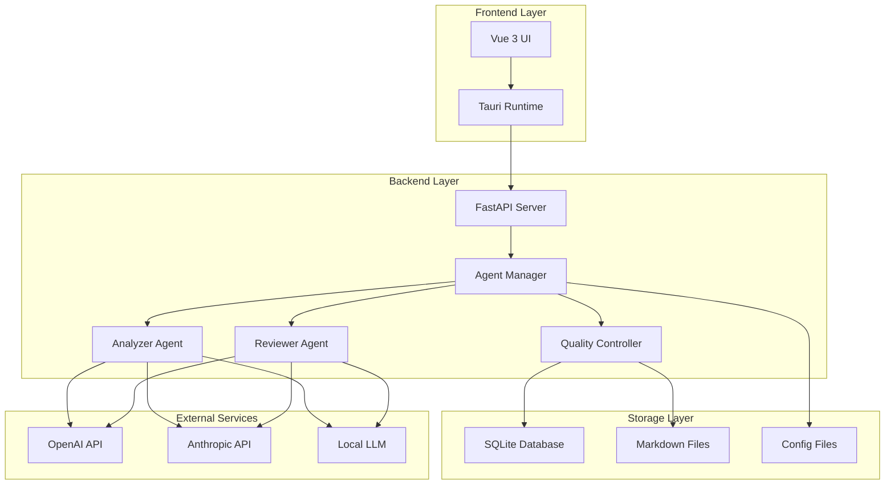
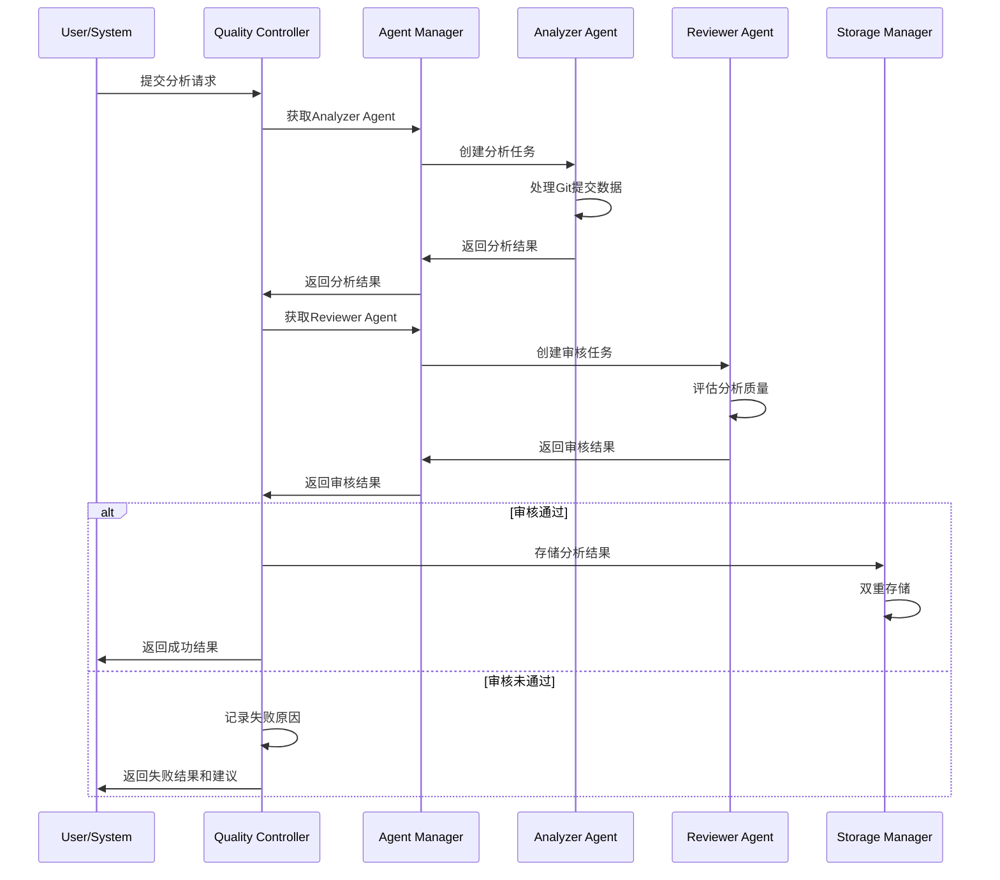
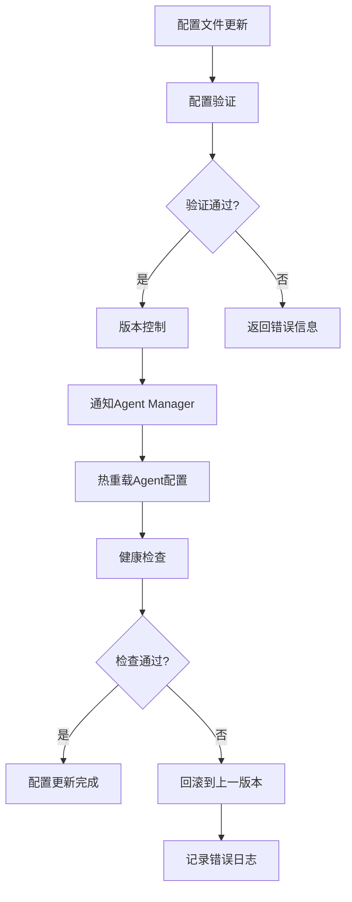

# GitMentor 技术架构设计文档
## Technical Architecture Design

### 文档信息
- **项目名称**: GitMentor AI Agent双重审核系统
- **版本**: v2.0
- **创建日期**: 2025年1月
- **最后更新**: 2025年1月
- **文档状态**: 详细设计
- **负责人**: 技术架构团队

---

## 1. 架构概述

### 1.1 系统架构图


### 1.2 核心设计原则
- **模块化**: 每个组件职责单一，松耦合设计
- **可扩展性**: 支持新Agent类型的动态添加
- **可配置性**: 所有关键参数支持配置化管理
- **容错性**: 完善的错误处理和恢复机制
- **性能优化**: 异步处理和缓存机制

### 1.3 技术选型说明
- **前端**: Vue 3 + TypeScript + Tauri (跨平台桌面应用)
- **后端**: FastAPI + Python 3.11 (高性能异步API)
- **存储**: SQLite + 文件系统 (轻量级本地存储)
- **AI集成**: 多LLM提供商支持 (OpenAI, Anthropic, 本地模型)
- **配置**: YAML + JSON (人类可读的配置格式)

---

## 2. 核心组件设计

### 2.1 Agent Manager (Agent管理器)

#### 2.1.1 组件职责
- Agent生命周期管理 (创建、启动、停止、销毁)
- Agent配置加载和热更新
- Agent间通信协调
- 负载均衡和任务分发
- 性能监控和健康检查

#### 2.1.2 类设计
```python
class AgentManager:
    def __init__(self, config_path: str):
        self.agents: Dict[str, BaseAgent] = {}
        self.config_manager = ConfigManager(config_path)
        self.task_queue = asyncio.Queue()
        self.metrics_collector = MetricsCollector()
    
    async def register_agent(self, agent_type: str, agent_class: Type[BaseAgent]):
        """注册新的Agent类型"""
        pass
    
    async def create_agent(self, agent_id: str, agent_type: str, config: Dict):
        """创建Agent实例"""
        pass
    
    async def process_task(self, task: AnalysisTask) -> ProcessResult:
        """处理分析任务"""
        pass
    
    async def reload_config(self, agent_id: str):
        """热重载Agent配置"""
        pass
```

#### 2.1.3 配置结构
```yaml
agent_manager:
  max_concurrent_tasks: 10
  task_timeout: 300
  health_check_interval: 60
  
agents:
  analyzer:
    class: "GitCommitAnalyzer"
    instances: 2
    config_file: "analyzer_config.yaml"
    
  reviewer:
    class: "QualityReviewer"
    instances: 1
    config_file: "reviewer_config.yaml"
```

### 2.2 Base Agent (基础Agent类)

#### 2.2.1 抽象接口设计
```python
from abc import ABC, abstractmethod
from typing import Dict, Any, List
from dataclasses import dataclass

@dataclass
class AgentInput:
    task_id: str
    data: Dict[str, Any]
    context: Dict[str, Any]
    metadata: Dict[str, Any]

@dataclass
class AgentOutput:
    task_id: str
    result: Dict[str, Any]
    confidence: float
    processing_time: float
    metadata: Dict[str, Any]

class BaseAgent(ABC):
    def __init__(self, agent_id: str, config: Dict[str, Any]):
        self.agent_id = agent_id
        self.config = config
        self.metrics = AgentMetrics()
        self.logger = logging.getLogger(f"agent.{agent_id}")
    
    @abstractmethod
    async def process(self, input_data: AgentInput) -> AgentOutput:
        """处理输入数据并返回结果"""
        pass
    
    @abstractmethod
    def validate_config(self, config: Dict[str, Any]) -> bool:
        """验证配置有效性"""
        pass
    
    @abstractmethod
    def get_capabilities(self) -> List[str]:
        """返回Agent能力列表"""
        pass
    
    async def health_check(self) -> bool:
        """健康检查"""
        pass
    
    async def reload_config(self, new_config: Dict[str, Any]):
        """重新加载配置"""
        pass
```

### 2.3 Analyzer Agent (分析Agent)

#### 2.3.1 具体实现
```python
class GitCommitAnalyzer(BaseAgent):
    def __init__(self, agent_id: str, config: Dict[str, Any]):
        super().__init__(agent_id, config)
        self.llm_client = self._init_llm_client()
        self.prompt_template = self._load_prompt_template()
    
    async def process(self, input_data: AgentInput) -> AgentOutput:
        """分析Git提交记录"""
        start_time = time.time()
        
        try:
            # 1. 数据预处理
            processed_data = await self._preprocess_commit_data(input_data.data)
            
            # 2. 构建提示词
            prompt = await self._build_prompt(processed_data)
            
            # 3. 调用LLM分析
            llm_response = await self._call_llm(prompt)
            
            # 4. 结果后处理
            analysis_result = await self._postprocess_result(llm_response)
            
            # 5. 计算置信度
            confidence = await self._calculate_confidence(analysis_result)
            
            processing_time = time.time() - start_time
            
            return AgentOutput(
                task_id=input_data.task_id,
                result=analysis_result,
                confidence=confidence,
                processing_time=processing_time,
                metadata={"agent_version": self.config.get("version", "1.0")}
            )
            
        except Exception as e:
            self.logger.error(f"Analysis failed: {str(e)}")
            raise AgentProcessingError(f"Analysis failed: {str(e)}")
    
    async def _preprocess_commit_data(self, commit_data: Dict) -> Dict:
        """预处理提交数据"""
        return {
            "commit_hash": commit_data.get("hash", ""),
            "message": commit_data.get("message", ""),
            "author": commit_data.get("author", ""),
            "files_changed": commit_data.get("files", []),
            "diff_summary": self._summarize_diff(commit_data.get("diff", "")),
            "timestamp": commit_data.get("timestamp", "")
        }
    
    async def _build_prompt(self, data: Dict) -> str:
        """构建分析提示词"""
        return self.prompt_template.format(**data)
    
    async def _call_llm(self, prompt: str) -> Dict:
        """调用LLM进行分析"""
        response = await self.llm_client.complete(
            prompt=prompt,
            max_tokens=self.config.get("max_tokens", 1000),
            temperature=self.config.get("temperature", 0.3)
        )
        return response
    
    def get_capabilities(self) -> List[str]:
        return [
            "commit_analysis",
            "semantic_understanding",
            "change_categorization",
            "impact_assessment"
        ]
```

### 2.4 Reviewer Agent (审核Agent)

#### 2.4.1 具体实现
```python
class QualityReviewer(BaseAgent):
    def __init__(self, agent_id: str, config: Dict[str, Any]):
        super().__init__(agent_id, config)
        self.quality_criteria = self._load_quality_criteria()
        self.llm_client = self._init_llm_client()
    
    async def process(self, input_data: AgentInput) -> AgentOutput:
        """审核分析结果质量"""
        start_time = time.time()
        
        try:
            # 1. 获取原始数据和分析结果
            original_data = input_data.data.get("original_commit")
            analysis_result = input_data.data.get("analysis_result")
            
            # 2. 执行多维度质量检查
            quality_scores = await self._evaluate_quality(original_data, analysis_result)
            
            # 3. 生成审核决策
            review_decision = await self._make_decision(quality_scores)
            
            # 4. 生成改进建议
            suggestions = await self._generate_suggestions(quality_scores, analysis_result)
            
            processing_time = time.time() - start_time
            
            review_result = {
                "approved": review_decision["approved"],
                "overall_score": review_decision["overall_score"],
                "dimension_scores": quality_scores,
                "suggestions": suggestions,
                "revision_required": review_decision["revision_required"]
            }
            
            return AgentOutput(
                task_id=input_data.task_id,
                result=review_result,
                confidence=review_decision["confidence"],
                processing_time=processing_time,
                metadata={"review_criteria_version": self.config.get("criteria_version", "1.0")}
            )
            
        except Exception as e:
            self.logger.error(f"Review failed: {str(e)}")
            raise AgentProcessingError(f"Review failed: {str(e)}")
    
    async def _evaluate_quality(self, original_data: Dict, analysis_result: Dict) -> Dict[str, float]:
        """多维度质量评估"""
        scores = {}
        
        # 准确性评估
        scores["accuracy"] = await self._evaluate_accuracy(original_data, analysis_result)
        
        # 完整性评估
        scores["completeness"] = await self._evaluate_completeness(original_data, analysis_result)
        
        # 一致性评估
        scores["consistency"] = await self._evaluate_consistency(analysis_result)
        
        # 清晰度评估
        scores["clarity"] = await self._evaluate_clarity(analysis_result)
        
        return scores
    
    async def _make_decision(self, quality_scores: Dict[str, float]) -> Dict:
        """基于质量分数做出审核决策"""
        overall_score = sum(quality_scores.values()) / len(quality_scores)
        threshold = self.config.get("approval_threshold", 0.85)
        
        approved = overall_score >= threshold and all(
            score >= self.config.get("min_dimension_score", 0.80) 
            for score in quality_scores.values()
        )
        
        return {
            "approved": approved,
            "overall_score": overall_score,
            "confidence": min(quality_scores.values()),
            "revision_required": not approved and overall_score >= 0.70
        }
    
    def get_capabilities(self) -> List[str]:
        return [
            "quality_assessment",
            "accuracy_evaluation",
            "completeness_check",
            "consistency_validation",
            "clarity_assessment"
        ]
```

### 2.5 Quality Controller (质量控制器)

#### 2.5.1 组件设计
```python
class QualityController:
    def __init__(self, config: Dict[str, Any]):
        self.config = config
        self.retry_policy = RetryPolicy(config.get("retry_policy", {}))
        self.storage_manager = StorageManager()
        self.metrics_collector = MetricsCollector()
    
    async def process_commit_analysis(self, commit_data: Dict) -> ProcessResult:
        """处理提交分析的完整流程"""
        task_id = self._generate_task_id()
        
        try:
            # 1. 第一阶段：分析
            analysis_result = await self._run_analysis_phase(task_id, commit_data)
            
            # 2. 第二阶段：审核
            review_result = await self._run_review_phase(task_id, commit_data, analysis_result)
            
            # 3. 决策和存储
            final_result = await self._make_final_decision(
                task_id, commit_data, analysis_result, review_result
            )
            
            # 4. 记录指标
            await self._record_metrics(task_id, final_result)
            
            return final_result
            
        except Exception as e:
            await self._handle_processing_error(task_id, e)
            raise
    
    async def _run_analysis_phase(self, task_id: str, commit_data: Dict) -> AgentOutput:
        """运行分析阶段"""
        analyzer_input = AgentInput(
            task_id=task_id,
            data=commit_data,
            context={"phase": "analysis"},
            metadata={}
        )
        
        return await self.retry_policy.execute(
            lambda: self.agent_manager.get_agent("analyzer").process(analyzer_input)
        )
    
    async def _run_review_phase(self, task_id: str, commit_data: Dict, analysis_result: AgentOutput) -> AgentOutput:
        """运行审核阶段"""
        reviewer_input = AgentInput(
            task_id=task_id,
            data={
                "original_commit": commit_data,
                "analysis_result": analysis_result.result
            },
            context={"phase": "review"},
            metadata={}
        )
        
        return await self.retry_policy.execute(
            lambda: self.agent_manager.get_agent("reviewer").process(reviewer_input)
        )
    
    async def _make_final_decision(self, task_id: str, commit_data: Dict, 
                                 analysis_result: AgentOutput, review_result: AgentOutput) -> ProcessResult:
        """做出最终决策并存储"""
        approved = review_result.result.get("approved", False)
        
        if approved:
            # 存储到双重存储系统
            await self.storage_manager.store_approved_analysis(
                commit_data, analysis_result, review_result
            )
            
            return ProcessResult(
                task_id=task_id,
                status="approved",
                analysis_result=analysis_result.result,
                review_result=review_result.result,
                stored=True
            )
        else:
            # 记录未通过的分析
            await self.storage_manager.store_rejected_analysis(
                commit_data, analysis_result, review_result
            )
            
            return ProcessResult(
                task_id=task_id,
                status="rejected",
                analysis_result=analysis_result.result,
                review_result=review_result.result,
                stored=False,
                suggestions=review_result.result.get("suggestions", [])
            )
```

---

## 3. 数据流程设计

### 3.1 分析流程图


### 3.2 配置管理流程


---

## 4. 存储架构设计

### 4.1 数据库设计

#### 4.1.1 核心表结构
```sql
-- Agent执行记录表
CREATE TABLE agent_executions (
    id INTEGER PRIMARY KEY AUTOINCREMENT,
    task_id TEXT NOT NULL,
    agent_id TEXT NOT NULL,
    agent_type TEXT NOT NULL,
    input_data TEXT NOT NULL,
    output_data TEXT NOT NULL,
    confidence_score REAL,
    processing_time REAL,
    status TEXT NOT NULL, -- 'success', 'failed', 'timeout'
    error_message TEXT,
    created_at TIMESTAMP DEFAULT CURRENT_TIMESTAMP
);

-- 质量控制记录表
CREATE TABLE quality_control_records (
    id INTEGER PRIMARY KEY AUTOINCREMENT,
    task_id TEXT NOT NULL,
    commit_hash TEXT NOT NULL,
    analyzer_execution_id INTEGER,
    reviewer_execution_id INTEGER,
    final_status TEXT NOT NULL, -- 'approved', 'rejected', 'pending'
    overall_quality_score REAL,
    retry_count INTEGER DEFAULT 0,
    completed_at TIMESTAMP,
    FOREIGN KEY (analyzer_execution_id) REFERENCES agent_executions (id),
    FOREIGN KEY (reviewer_execution_id) REFERENCES agent_executions (id)
);

-- Agent配置版本表
CREATE TABLE agent_config_versions (
    id INTEGER PRIMARY KEY AUTOINCREMENT,
    agent_type TEXT NOT NULL,
    version TEXT NOT NULL,
    config_data TEXT NOT NULL,
    is_active BOOLEAN DEFAULT FALSE,
    created_at TIMESTAMP DEFAULT CURRENT_TIMESTAMP,
    activated_at TIMESTAMP
);
```

#### 4.1.2 索引设计
```sql
-- 性能优化索引
CREATE INDEX idx_agent_executions_task_id ON agent_executions(task_id);
CREATE INDEX idx_agent_executions_agent_type ON agent_executions(agent_type);
CREATE INDEX idx_quality_control_commit_hash ON quality_control_records(commit_hash);
CREATE INDEX idx_quality_control_status ON quality_control_records(final_status);
```

### 4.2 文件存储设计

#### 4.2.1 目录结构
```
/workspace/
├── repositories/
│   ├── {repo_name}/
│   │   ├── contributors/
│   │   │   ├── {contributor_email}/
│   │   │   │   ├── {year}/
│   │   │   │   │   ├── {month}/
│   │   │   │   │   │   ├── commits/
│   │   │   │   │   │   │   ├── {commit_hash}.md
│   │   │   │   │   │   │   └── analysis_metadata.json
│   │   │   │   │   │   ├── daily_summaries/
│   │   │   │   │   │   │   └── {date}.md
│   │   │   │   │   │   └── monthly_summary.md
│   │   │   │   │   └── yearly_summary.md
│   │   │   │   └── contributor_profile.md
│   │   │   └── team_analytics/
│   │   │       ├── collaboration_matrix.md
│   │   │       └── knowledge_transfer.md
│   │   ├── repository_overview.md
│   │   └── quality_metrics/
│   │       ├── analysis_quality_trends.md
│   │       └── agent_performance_reports.md
├── configs/
│   ├── agents/
│   │   ├── analyzer/
│   │   │   ├── prompts/
│   │   │   └── config.yaml
│   │   └── reviewer/
│   │       ├── prompts/
│   │       └── config.yaml
│   └── repositories.yaml
└── logs/
    ├── agent_logs/
    ├── quality_control_logs/
    └── system_logs/
```

#### 4.2.2 文件格式标准
```markdown
# 提交分析报告模板
## {commit_hash}.md

### 基本信息
- **提交哈希**: {commit_hash}
- **作者**: {author_name} <{author_email}>
- **时间**: {commit_timestamp}
- **分支**: {branch_name}

### Analyzer Agent 分析结果
- **任务ID**: {task_id}
- **Agent版本**: {agent_version}
- **处理时间**: {processing_time}s
- **置信度**: {confidence_score}

#### 分析内容
- **总结**: {summary}
- **类型**: {change_type}
- **影响级别**: {impact_level}
- **文件变更**: {files_changed}

### Reviewer Agent 审核结果
- **审核状态**: {review_status}
- **质量评分**: {quality_score}
- **审核时间**: {review_time}s

#### 质量维度评分
- **准确性**: {accuracy_score}
- **完整性**: {completeness_score}
- **一致性**: {consistency_score}
- **清晰度**: {clarity_score}

#### 审核意见
{review_feedback}

#### 改进建议
{improvement_suggestions}

### 元数据
```json
{
  "task_id": "{task_id}",
  "processing_pipeline": "analyzer -> reviewer",
  "final_status": "{final_status}",
  "storage_timestamp": "{storage_timestamp}",
  "data_version": "2.0"
}
```
```

---

*本文档将根据开发进展和技术演进持续更新和完善。*
